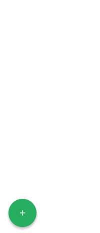

> A tiny (~1kb gzip) Floating Action Button for React

Want to use a Floating Action Button without having to import the whole Material Design Components library? Weighing in
at only around 1kb gzipped, React Tiny FAB is a great solution. It is a lightweight, fast, and flexible component.



## Install

```
npm install react-tiny-fab
yarn add react-tiny-fab
```

## Usage
There are two components available for import - `Fab` and `Action`. You import them like this:

```
import { Fab, Action } from 'react-tiny-fab';
import 'react-tiny-fab/styles.css';
```

Here is an example of how you would use the components:
```
<Fab
  mainButtonStyles={mainButtonStyles}
  actionButtonStyles={actionButtonStyles}
  position={position}
  icon={<MdAdd />}
  event={event}
>
  <Action
    text="Email"
    onClick={handleOnClick}
  >
    <MdEmail />
  </Action>
</Fab>
```

## Components
### `<Fab />` Component
This is the main component that controls the Floating Action Button.

#### `<Fab />` props
| Prop                 | Type                       | Default                   | Required | Description                                                                                                                                |
|----------------------|----------------------------|-------------------------- |----------|--------------------------------------------------------------------------------------------------------------------------------------------|
| `mainButtonStyles`   | React.CSSProperties object | {}                        | false    | This object is passed to the main button's `style` prop so use React styles to style the button.                                           |
| `position`           | object                     | `{ bottom: 0, right: 0 }` | false    | Where do you want your FAB to be located? Use `top`, `left`, `bottom`, `right` properties to declare where you want the FAB to be positioned. |
| `icon`               | React Element/Component    |                           | true     | This element/component will be the used as the icon for the main button. This can be text, or a Font Awesome icon, or any other component. |
| `event`              | string                     | 'hover'                   | false    | What type of event do you want to make the FAB menu active? This can be either `click` or `hover`.                                         |
| `children`           | React Element/Component    |                           | false    | This is the children that will be mapped and rendered. This can be anything. There can be up to 6, but no more than 6. An `Action` component is provided out of the box.           |

> Based on the `position` prop, the FAB will figure out the direction of the `<Action />` `text` and also which way to 
> expand when hovered/clicked (up or down).

### `<Action />` Component 
This component represents the smaller buttons that appear when the main button is hovered/clicked. Now, you do not have 
to use this component. You can use your own custom component(s) and create something totally different than a Floating
Action Button. For instance, you could create your own "Support Button" that when clicked, will display a chat box or 
some type of form that submits a contact request.

#### `<Action />` props
| Prop       | Type                    | Default | Required | Description                                                                  |
|------------|-------------------------|---------|----------|------------------------------------------------------------------------------|
| `text`     | string                  | ""      | false    | This is the text that will be displayed when one of the actions is hovered.  |
| `children` | React Element/Component |         | false    | This will be the icon/text for the action.                                   |

## Demo
Check out the [index.js](./example/src/index.js) file in the example folder for an example of the traditional FAB and 
also a form pop-up that could be used to send contact information, or something else. 

## Contributing
If you find a bug, submit an issue with enough information to reproduce the bug. If you have a fix, please do not 
hesitate to submit a PR. If you feel that the API needs to be modified, open an issue so that we can discuss it first.

### Running the dev environment
1. Clone the repo - `git clone https://github.com/dericgw/react-tiny-fab.git` && `cd react-tiny-fab`
2. Install the dependencies - `npm i`
3. Setup the example - `npm run setup-example`
4. Start the dev environment (watches for changes and hot-reloads) - `npm run start`

Once you get that going, you should be able to make changes and the page should refresh automatically when those changes
are saved.

### Testing
This package is only one JS file and it is tested pretty good. Make sure that none of the tests are breaking if changes
are made. Also, if you add new functionality and it *warrants* testing, please add tests. If you need help with this, I
will gladly help.

## License (MIT)
[Check it out here.](./LICENSE.md)
 